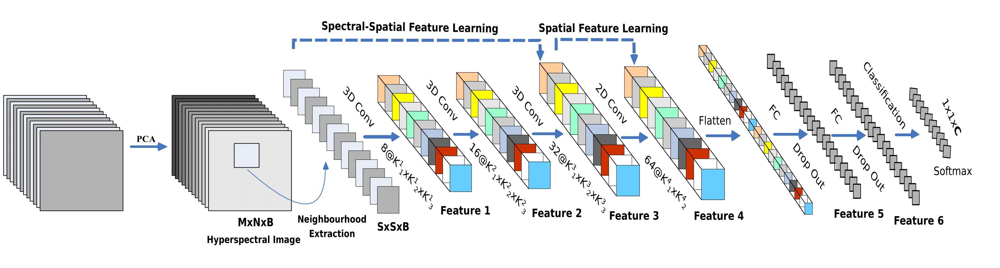
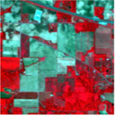
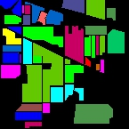
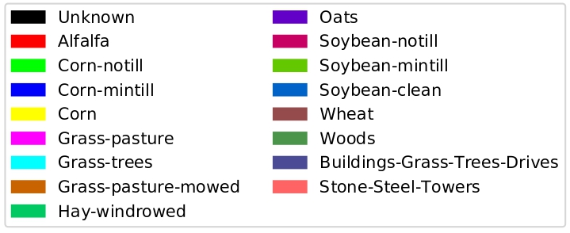
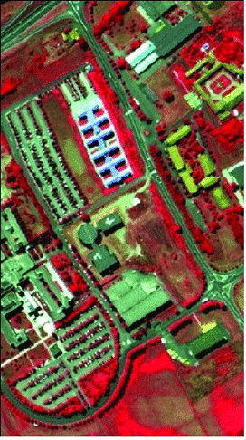
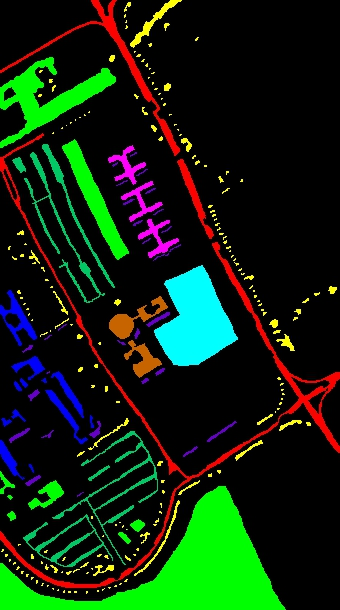
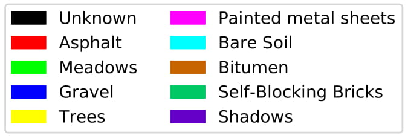
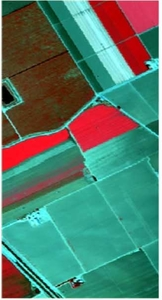
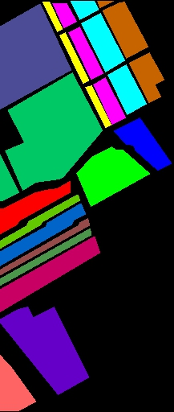
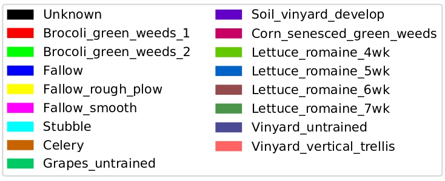

# Hybrid-Spectral-Net for Hyperspectral Image Classification.

## Description

The  HybridSN  is  spectral-spatial  3D-CNN  followed  by spatial 2D-CNN. The 3D-CNN facilitates the joint spatial-spectral feature  representation  from  a  stack  of  spectral  bands.  The  2D-CNN  on  top  of  the  3D-CNN  further  learns  more  abstract  level spatial  representation. 

## Model

Fig: Proposed HybridSpectralNet (HybridSN) Model with 3D and 2D convolutions for hyperspectral image (HSI) classification.

## Prerequisites

- [Anaconda 2.7](https://www.anaconda.com/download/#linux)
- [Tensorflow 1.3](https://github.com/tensorflow/tensorflow/tree/r1.3)
- [Keras 2.0](https://github.com/fchollet/keras)

## Results

### Indian Pines (IP) dataset

   

Fig.2  The IN dataset classification result (Overall Accuracy 99.81%) of Hybrid-SN using 30% samples for training. (a) False color image. (b) Ground truth labels. (c) Classification map. (d) Class legend. 

### University of Pavia (UP) dataset

   

Fig.3  The UP dataset classification result (Overall Accuracy 99.99%) of Hybrid-SN using 30% samples for training. (a) False color image. (b) Ground truth labels. (c) Classification map. (d) Class legend.

### Salinas Scene (SS) dataset

   

Fig.4  The UP dataset classification result (Overall Accuracy 100%) of Hybrid-SN using 30% samples for training. (a) False color image. (b) Ground truth labels. (c) Classification map.

#### Detailed results can be found in the [Supplementary Material](supplementary-material.pdf)

## Citation

If you use [HybridSN](https://github.com/gokriznastic/HybridSN) and [S3EResBoF](https://github.com/swalpa/S3EResBoF) code in your research, we would appreciate a citation to both the original paper:

	@article{roy2019hybridsn,
        	title={HybridSN: Exploring 3D-2D CNN Feature Hierarchy for Hyperspectral Image Classification},
		author={Roy, Swalpa Kumar and Krishna, Gopal and Dubey, Shiv Ram and Chaudhuri, Bidyut B},
		journal={IEEE Geoscience and Remote Sensing Letters},
		vol.={17},
		no.={2},
		pp.={277-281},
		year={2020}
		}
	@article{roy2020lightweight,
		title={Lightweight Spectral-Spatial Squeeze-and-Excitation Residual Bag-of-Features Learning for Hyperspectral Classification},
		author={Roy, Swalpa Kumar and Chatterjee, Subhrasankar and Bhattacharyya, Siddhartha and Chaudhuri, Bidyut B. and Platosˇ, Jan},
		journal={IEEE Transactions on Geoscience and Remote Sensing},
		year={2020}
		}
   

## Acknowledgement

Part of this code is from a implementation of Classification of HSI using CNN by [Konstantinos Fokeas](https://github.com/KonstantinosF/Classification-of-Hyperspectral-Image).

## License

Copyright (c) 2019 Gopal Krishna. Released under the MIT License. See [LICENSE](LICENSE) for details.
