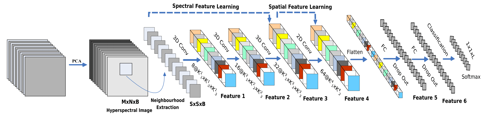

# Implementation of Hybrid-Spectral-Net for Hyperspectral Image Classification.

## Description

The  HybridSN  is  spectral-spatial  3D-CNN  followed  by spatial 2D-CNN. The 3D-CNN facilitates the joint spatial-spectral feature  representation  from  a  stack  of  spectral  bands.  The  2D-CNN  on  top  of  the  3D-CNN  further  learns  more  abstract  level spatial  representation. 

## Model

Fig: Proposed HybridSpectralNet (HybridSN) Model with 3D and 2D convolutions for hyperspectral image (HSI) classification.

## Prerequisites

- [Anaconda 2.7](https://www.anaconda.com/download/#linux)
- [Tensorflow 1.3](https://github.com/tensorflow/tensorflow/tree/r1.3)
- [Keras 2.0](https://github.com/fchollet/keras)

## Results

### Indian Pines (IP) dataset

  

Fig.4  The IN dataset classification result (Overall Accuracy 99.86%) of SSRN using 30% samples for training. (a) False color image. (b) Ground truth labels. (c) Classification map. 

### University of Pavia (UP) dataset

  

Fig.5  The UP dataset classification result (Overall Accuracy 99.98%) of SSRN using 30% samples for training. (a) False color image. (b) Ground truth labels. (c) Classification map.

### Salinas (SA) dataset

  

Fig.5  The UP dataset classification result (Overall Accuracy 100%) of SSRN using 30% samples for training. (a) False color image. (b) Ground truth labels. (c) Classification map.

## Citation

If you use this code in your research, we would appreciate a citation to the original paper:

	@article{roy2019hybridsn,
            title={HybridSN: Exploring 3D-2D CNN Feature Hierarchy for Hyperspectral Image Classification},
            author={Roy, Swalpa Kumar and Krishna, Gopal and Dubey, Shiv Ram and Chaudhuri, Bidyut B},
            journal={arXiv preprint arXiv:1902.06701},
            year={2019}
        }

## Acknowledgement

Part of codes is from a implementation of Classification of HSI using CNN by [Konstantinos Fokeas](https://github.com/KonstantinosF/Classification-of-Hyperspectral-Image).
